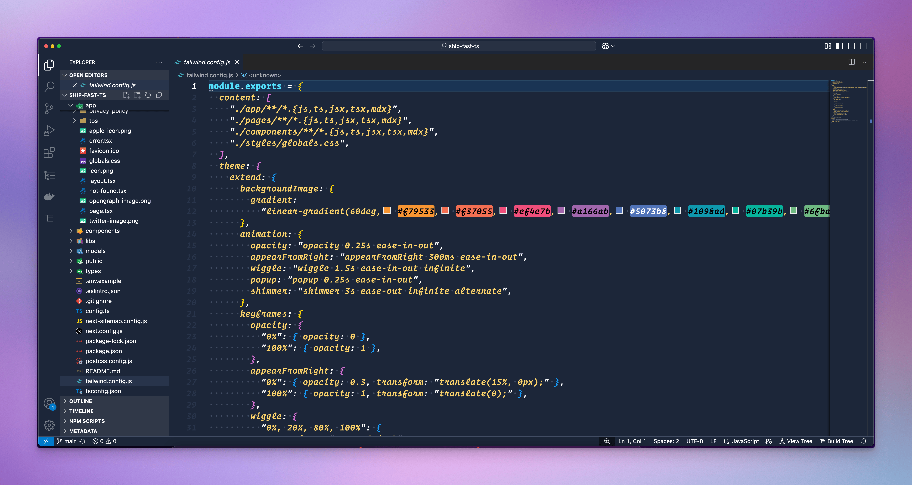

# Hyperlink Theme for VS Code

<div align="center">



[](https://github.com/dabbleintech/hyperlink-vscode)
[](https://opensource.org/licenses/MIT)
[](https://code.visualstudio.com/)

*A meticulously crafted dark theme with vibrant colors, inspired by [Stef Kors' Hyperlink theme](https://github.com/StefKors/Hyperlink-Nova-Theme) for Nova editor.*

[Installation](#installation) • [Features](#features) • [Screenshots](#screenshots) • [Contributing](#contributing)

</div>

---

## ✨ Features

The Hyperlink theme brings the beautiful color palette from Nova to VS Code with careful attention to detail:

### 🎨 Color Palette

- **Background**: Deep blue (#1C2639) with lighter elements (#28344B)
- **Syntax Highlighting**:
  - 🟡 **Yellow/Gold** `#FDD46B` - Keywords, strings, boolean values
  - 🔵 **Cyan** `#53E0FC` - Types, classes, HTML tags
  - 🟠 **Orange/Red** `#F08261` - Variables, arguments
  - 🟢 **Green** `#B8E97B` - Functions, methods
  - 🟣 **Purple** `#C67BE9` - Properties
  - ⚪ **Light Gray** `#A8ADB7` - Comments
  - ⚪ **White** `#FFFFFF` - Text, operators

### 🎯 Theme Highlights

- ✅ Fully customized UI elements matching the code styling
- ✅ Terminal colors complementing the editor theme
- ✅ Optimized for long coding sessions with reduced eye strain
- ✅ Excellent contrast ratios for improved readability
- ✅ Consistent color semantics across all languages

---

## 📦 Installation

### Method 1: VS Code Marketplace (Recommended)

*Coming soon to the VS Code Marketplace!*

### Method 2: Install from VSIX

1. Download the latest `.vsix` file from [Releases](https://github.com/dabbleintech/hyperlink-vscode/releases)
2. Open VS Code
3. Go to Extensions (`Ctrl+Shift+X` / `Cmd+Shift+X`)
4. Click the `...` menu at the top of the Extensions panel
5. Select **Install from VSIX...**
6. Choose the downloaded `.vsix` file

### Method 3: Manual Installation

1. Clone this repository:
   ```bash
   git clone https://github.com/dabbleintech/hyperlink-vscode.git
   ```

2. Copy the folder to your VS Code extensions directory:
   - **Windows**: `%USERPROFILE%\.vscode\extensions`
   - **macOS**: `~/.vscode/extensions`
   - **Linux**: `~/.vscode/extensions`

3. Restart VS Code

### Activating the Theme

1. Open Command Palette (`Ctrl+Shift+P` / `Cmd+Shift+P`)
2. Type `Preferences: Color Theme`
3. Select **Hyperlink** from the list

Or navigate to: `File > Preferences > Color Theme > Hyperlink`

---

## 📸 Screenshots

<div align="center">

### Code Editor


### Full UI Experience


</div>

---

## 🛠️ Development

Want to customize or build the theme yourself?

### Prerequisites

```bash
npm install -g @vscode/vsce
```

### Building the Extension

```bash
# Clone the repository
git clone https://github.com/dabbleintech/hyperlink-vscode.git
cd hyperlink-vscode

# Package the extension
vsce package

# This will generate a .vsix file
```

---

## 🤝 Contributing

Contributions are welcome! Whether it's:

- 🐛 Bug reports
- 💡 Feature suggestions
- 🎨 Color refinements
- 📝 Documentation improvements

Please see [CONTRIBUTING.md](CONTRIBUTING.md) for guidelines.

---

## 📝 Changelog

See [CHANGELOG.md](CHANGELOG.md) for a list of changes and version history.

---

## 📄 License

This project is licensed under the MIT License - see the [LICENSE](LICENSE) file for details.

---

## 🙏 Acknowledgments

- **Original Theme**: [Hyperlink for Nova](https://github.com/StefKors/Hyperlink-Nova-Theme) by [Stef Kors](https://github.com/StefKors)
- **Adapted for VS Code by**: [Nik Kale](https://github.com/nikkale)

---

<div align="center">

**[⬆ back to top](#hyperlink-theme-for-vs-code)**

Made with ❤️ for the VS Code community

</div>
